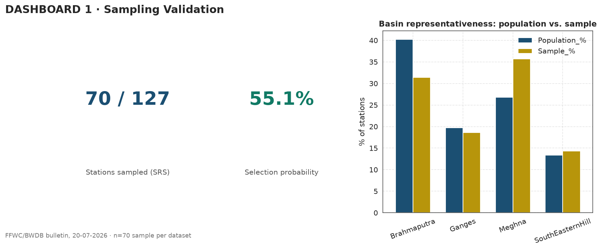
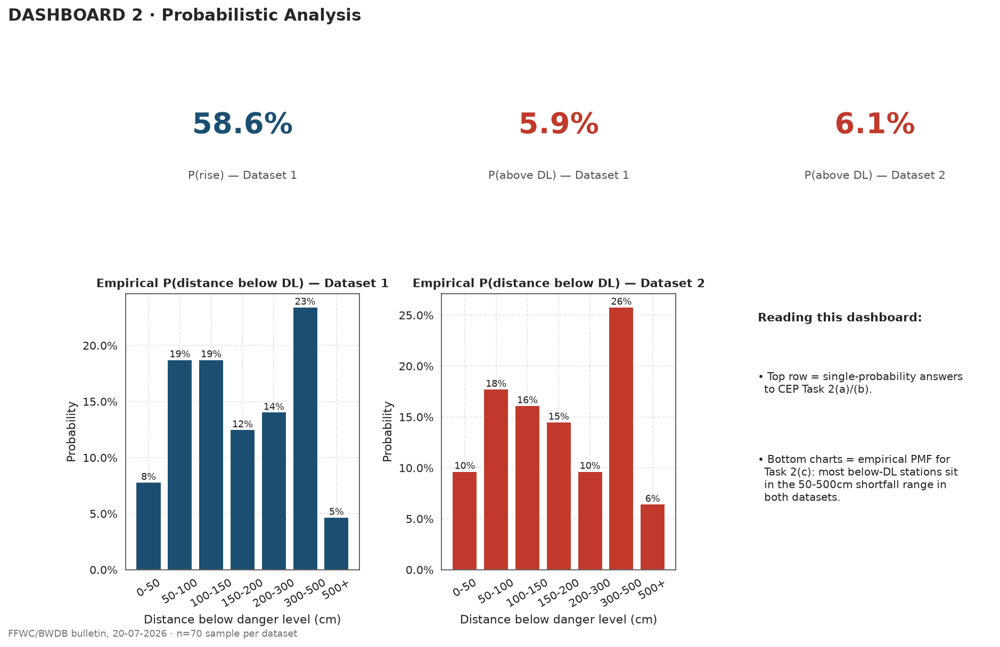
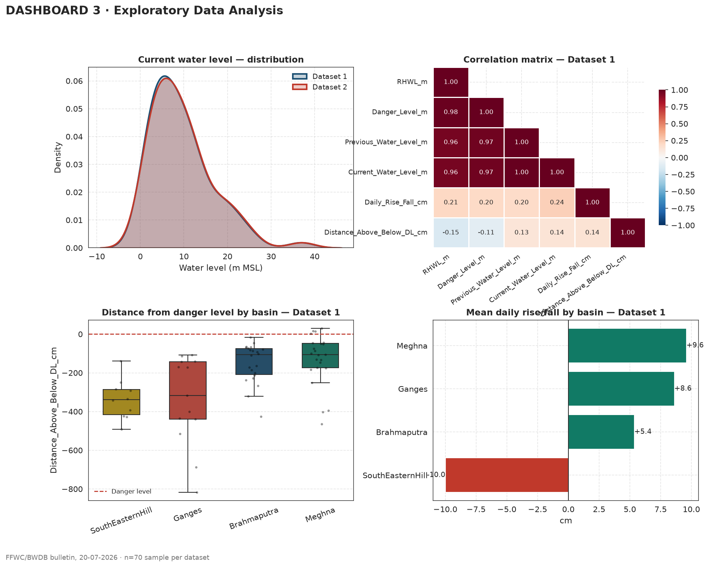
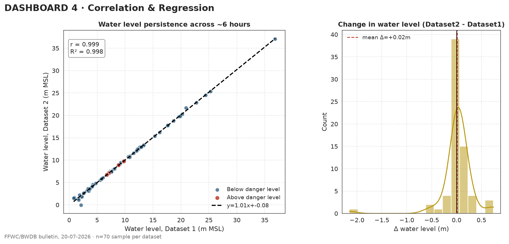

# Flood Risk Analytics

Statistical and probabilistic analysis of river water-level monitoring stations across Bangladesh's flood-warning network, built on real bulletin data published by the **Flood Forecasting and Warning Centre (FFWC)**, Bangladesh Water Development Board (BWDB).

The project quantifies flood risk exposure across 127 monitoring stations nationwide — how many stations are rising, how many are already past danger level, and how that risk is distributed across river basins — using a statistically sound sampling methodology, probability theory, and exploratory data analysis.

---

## Overview

During monsoon season, BWDB's 127 river stations can't all be monitored with equal intensity — limited manpower forces prioritization decisions. This project analyzes a random sample of stations from two time-paired bulletins to answer:

- What fraction of stations are experiencing a rise in water level?
- What fraction are already above danger level?
- How is "distance below danger level" distributed across stations that are still safe?
- Do water levels persist predictably over a short time window, and which basins carry the most risk?

The analysis is built entirely in Python and outputs a set of dashboard-style visualizations designed to be dropped directly into a written report or presentation.

---

## Data

| Source | Description |
|---|---|
| FFWC River Situation Bulletin | Daily/intraday river station readings — current water level, danger level (DL), recorded highest water level (RHWL), rise/fall, distance from DL |
| **Dataset 1** | 19-07-2026 vs 20-07-2026 09:00 hrs |
| **Dataset 2** | 20-07-2026 09:00 hrs vs 20-07-2026 15:00 hrs |
| Population | 127 monitoring stations, 4 river basins (Brahmaputra, Ganges, Meghna, South Eastern Hill) |
| Sample | n = 70 stations per dataset, drawn via **Simple Random Sampling**, same 70 stations paired across both datasets |

Raw data is provided as an Excel workbook (`EDA_Input_Datasets-1.xlsx`) with separate sheets for the full population and the drawn sample, for each dataset.

---

## Methodology

1. **Sampling validation** — confirms the provided sample is a genuine, unbiased subset of the population (station-ID integrity check, basin-proportion comparison against the full 127).
2. **Probabilistic analysis** — computes P(rise in water level), P(station above danger level), and constructs the empirical probability distribution of "distance below danger level" via binned relative frequencies.
3. **Exploratory data analysis** — missing-value profiling, full descriptive statistics (mean, median, mode, standard deviation, variance, range, IQR), distribution and basin-level visualizations, and a two-sample comparison.
4. **Correlation & regression** — Pearson correlation and simple linear regression between the two time-paired datasets to test water-level persistence over the ~6-hour gap, plus a paired t-test for statistical significance.

---

## Results at a glance

| Metric | Value |
|---|---|
| P(rise in water level) — Dataset 1 | 58.6% |
| P(station above danger level) — Dataset 1 | 5.9% |
| P(station above danger level) — Dataset 2 | 6.1% |
| Correlation between datasets (water level) | r = 0.999, R² = 0.998 |
| Paired t-test (Dataset 1 vs Dataset 2) | p = 0.71 → no significant change over ~6 hours |
| Basin with highest average rise | Meghna (+9.6 cm/day) |
| Basin with net fall | South Eastern Hill (−10.0 cm/day) |

---

## Visualizations

All figures are generated programmatically with `matplotlib`/`seaborn` and saved to `figures/`.

**Dashboard 1 — Sampling Validation**
Confirms SRS integrity and basin representativeness of the 70-station sample against the full population.



**Dashboard 2 — Probabilistic Analysis**
P(rise), P(above danger level) for both datasets, and the empirical probability distribution of distance below danger level.



**Dashboard 3 — Exploratory Data Analysis**
Water level distribution, correlation matrix, basin-level boxplots, and mean rise/fall by basin.



**Dashboard 4 — Correlation & Regression**
Water-level persistence between the two time points, with regression fit and change-in-level distribution.



---

## Project structure

```
flood-risk-analytics/
├── flood_analysis.py           # main analysis script
├── EDA_Input_Datasets-1.xlsx   # source data (full population + n=70 samples)
├── figures/                    # generated output charts
│   ├── dashboard1_sampling.png
│   ├── dashboard2_probability.png
│   ├── dashboard3_eda.png
│   └── dashboard4_regression.png
└── README.md
```

---

## Setup & usage

```bash
git clone https://github.com/Hurairiam/flood-risk-analytics.git
cd flood-risk-analytics
pip install pandas numpy matplotlib seaborn scipy openpyxl
python flood_analysis.py
```

Running the script prints a step-by-step analysis log to the console and saves all four dashboards to `figures/`. With `SHOW_PLOTS = True` (default), each dashboard also opens as an interactive matplotlib window.

---

## Tech stack

- **Python** — pandas, NumPy, SciPy (statistics), matplotlib & seaborn (visualization), openpyxl (Excel I/O)

---

## Team

| Name | GitHub |
|---|---|
| Abu Huraira | [@Hurairiam](https://github.com/Hurairiam) |
| Saif Hasan Khan | [@saifhasankhan197-hub](https://github.com/saifhasankhan197-hub) |
| Abdullah Tanvir | [@GREEN1971](https://github.com/GREEN1971) |
| Iqbal Hossain Howlader | [@Iqbal-Hossain369](https://github.com/Iqbal-Hossain369) |
| Aysha Saheba Mostafa | [@ayshasaheba](https://github.com/ayshasaheba) |

CSE undergraduates, University of Liberal Arts Bangladesh

---

## License

This project is released under the MIT License — see `LICENSE` for details.